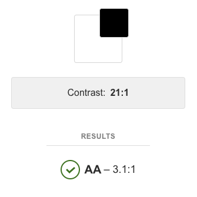
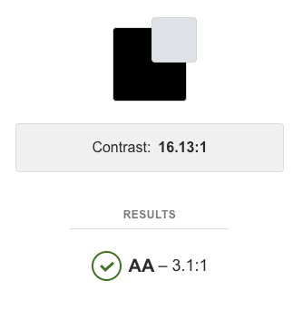
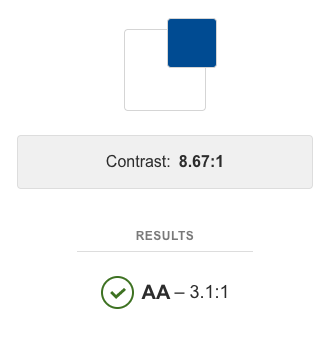
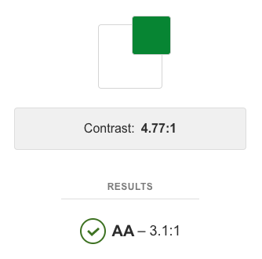

# SpotiShare

[View Project](https://md-milestone-project3.herokuapp.com/) 
SpotiShare is a website for users to share their playlists (on Spotify) with other users, in an open and categorized channel for everyone to enjoy, and discover new music and broaden the taste in music.
 
# UX
 Wireframe: [Figma Link](https://www.figma.com/file/E9R9Wg3ZNlL6vyyUKqGvL6/Untitled?node-id=0%3A1)

## Goal
The main focus of the user experience of this project, is clear, simple and easy interaction avoiding confusion and uncertainty of action. It is achieved by simple layout, proper accessibility, and use of industry-standard practices in navigation.

## Who is this project for
This project is for people wanting to share, and discover music recommended by others. Additionally this website is focused on people who use, or are familiar with Spotify, which limits the potential userbase.

## What does it fulfil?
This project displays and lets users share Spotify Playlists stored in a database. It also uses, Spotify API to display cover art and track list limited to a 100 tracks

## What is that users want to achive?
Users want to share or discover new playlists.

## User Stories 
- As a user, I can filter playlists by Category 'Work' so I can only see Playlist from that category.
- As a user, I can play the playlist, so I can listen to it.
- As a user, I can edit the playlist name so its name better reflects its content.
- As a user, I can share my favorite playlist so that more people have a chance to enjoy it.
- As a user, I can view a tracklist for the playlist, so that I can see its contents before listening
## Accessibility
 To ensure accessibility projects follows [WCAG Standard](https://www.w3.org/WAI/standards-guidelines/wcag/). In short contrast of text and background is given a score which is compared to the standardised score system
 - AAA - more than enough contrast (score of at least 7.0)
 - AA - the sweet spot for text sizes below 18pt (score of at least 4.5)
 - AA Large - acceptable for text sizes 18pt and larger (score of at least 3.0)
 - Fail - any score below 3.0

## Features
 
### Existing Features
- Ability to add a playlist - allows users to add, by filling out 'Add a playlist' form and submitting it to database
- Ability to edit and update a playlist - allows users to edit a playlist, by clicking EDIT and filling out the form and submitting it to the database
- Ability to delete a playlist - allows users to delete by clicking the delete button on the edit playlist page
- Ability play a playlist - allows the user to listen to the chosen playlist by clicking 'Play on Spotify' button
- View playlist - allows the user to display tracklist from the playlist by clicking 'View playlist button'up to 100 tracks*

### Funtionality found in testing
- Error notification when the category is empty (Playlist category view)
- Error image if API failed to download the playlist image (Playlist list/Playlist category view)
- Error notification when API couldn't produce a list of tracks in (View Playlist functionality)

* IMPORTANT NOTE - "View Playlists" feature is currently slow, most likely due to how the list of tracks is rendered. Large playlists may take up to 40-60sec.

### Features Left to Implement
- User AUTH
- Ability to Login with Users Spotify Account and follow playlists with that account
- Like system
- Featured section judged by the number of likes and manual picks
- Speedup 'View Playlist' functionality

## Technologies Used

- [Spotify API](https://jquery.com)
    - The project uses **Spotify API** to display Playlist images and tracklist.
- [JQuery](https://jquery.com)
    - The project uses **JQuery** to simplify DOM manipulation.
- [Bootstrap](https://jquery.com)
    - The project uses **Bootstrap** for CSS Grid and Navigation functionality.
- [Python](https://jquery.com)
    - The project uses **Python** to work with API and communicate with Flask.
- [Flask](https://jquery.com)
    - The project uses **Flask** to generate HTML and display data through templates and Python.
- [MongoDB](https://jquery.com)
    - The project uses **MongoDB** as a database.
- [Heroku](https://jquery.com)
    - The project uses **Heroku** as the to-the-user deployment method.
- [GitHub](https://jquery.com)
    - The project uses **Github** for backup and version control.

## Testing
The entirety of the project was tested manually and through trial and error method. Separate python files were created to test functions in an isolated environment, printing variables and API responses to console in aim to verify that they function properly and as expected.

Through testing opportiunity for new functionalities was found as read above in 'Functionality found in testing' section.

### Mobile Respo
Website was build as desktop-first design and was adapted to mobile screen with use of `media queries` in CSS. 

Respo was tested in Google Chromes Dev Tools, Iphone X and Iphone Xr where it didn't dispay any issues.

Website as also tested with a range of web browsers:
- Desktop:  Opera, FireFox, Safari, Chrome and Edge
- Mobile: Safari, Chrome

## Deployment
This project was developed using [Miscrosoft Visual Studio Code](https://code.visualstudio.com/).
Git was used for version control and backup, it was then pushed to a remote repository on [GitHub](https://www.github.com/),
Once code was functional it was deployed to [Heroku](https://www.heroku.com/)

## Heroku Deployment process
1. Create Heroku Account
2. Create Heroku App
3. Create `requirements.txt` file: 
`pip freeze > requirements.txt`
4.  Create `Procfile` containg `web: python app.py`
5. Login to Heroku through terminal:  `heroku login`
6. Clone the repository:  `$ git:clone -a appname` `$cd appname`
7. Deploy the repository: `git add .` `git commit -am "message"` `git push heroku master`

## Credits
- WCAG Rundown by [Contrast App](https://usecontrast.com/guide) 
- WCAG Scores by [Stark Plugin](https://getstark.co/) for [Figma](https://www.figma.com/)
- [Bootstrap Navigation snippet](https://getbootstrap.com/docs/4.3/components/navbar/)

### Content
- All the playlists are publicly avaiable through Spotify
- All other writen content is my own

### Media
All the playlist covers are taken through Spotify API and belong to Spotify Users who created the playlist or are generated from cover art by Spotify, Cover art belong to respected right holders.

## Acknowledgements
[Spotify](https://www.spotify.com) - providing platform and [API](https://developer.spotify.com/documentation/web-api/)
[Justice](http://www.justice.church/) - my favourite band 